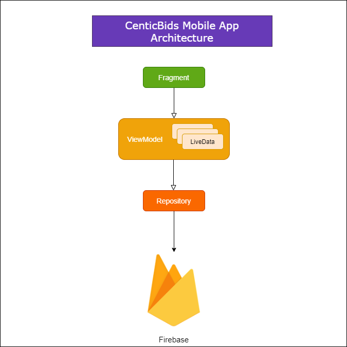
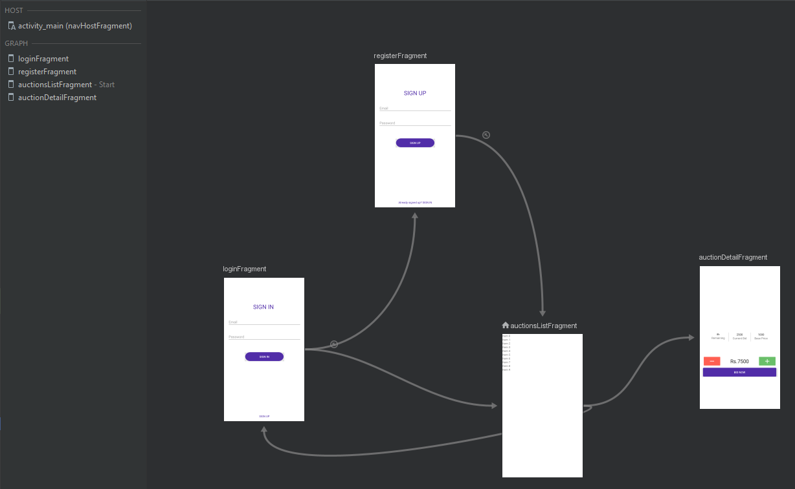
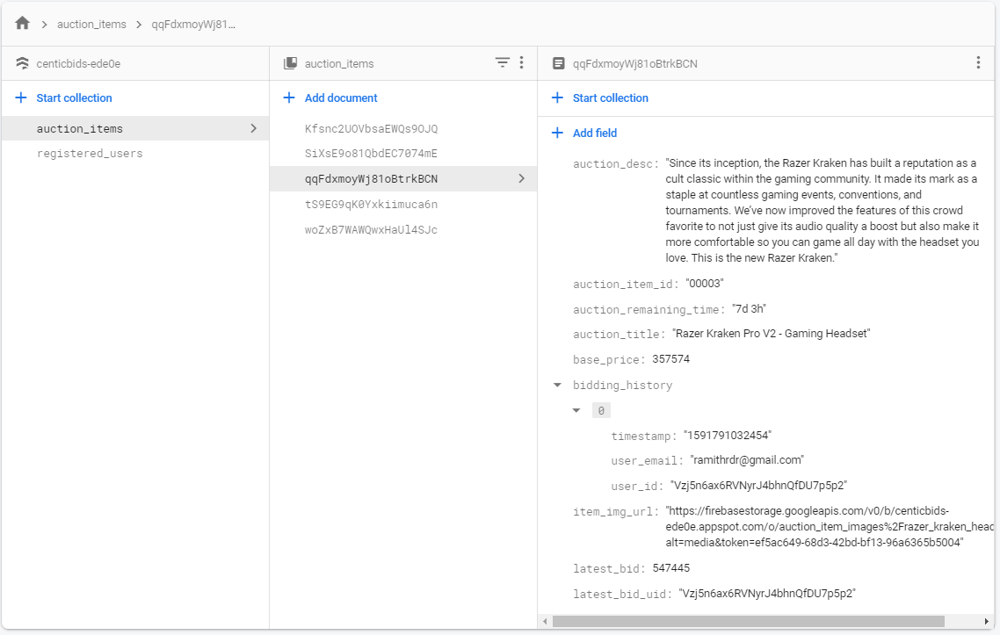
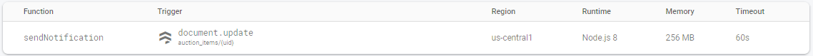
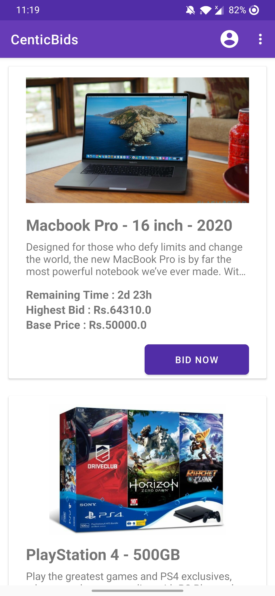
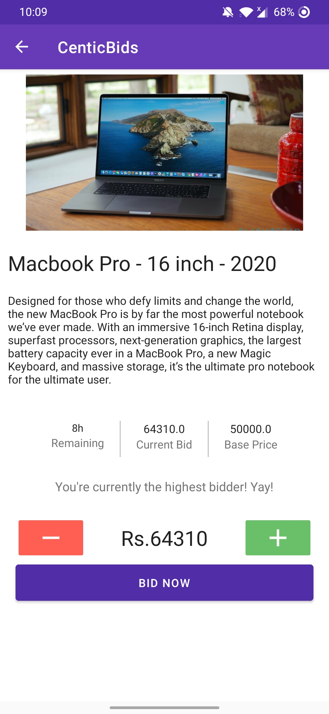
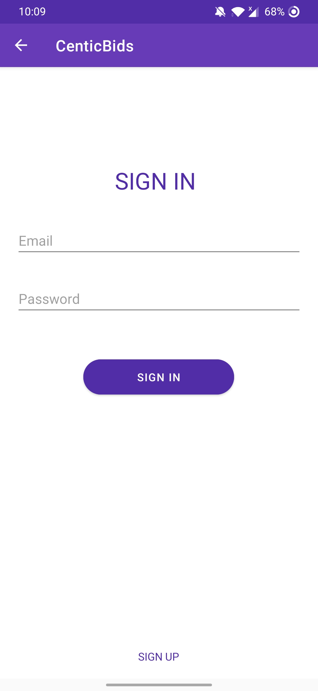
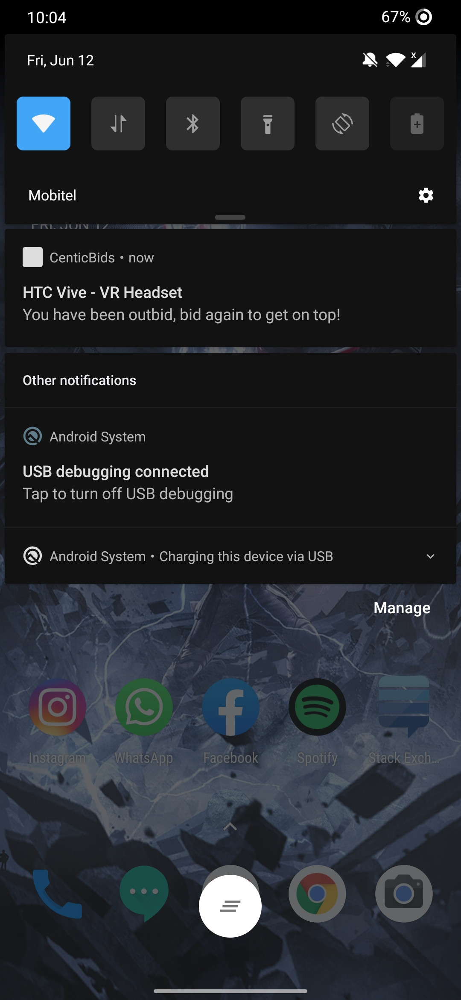
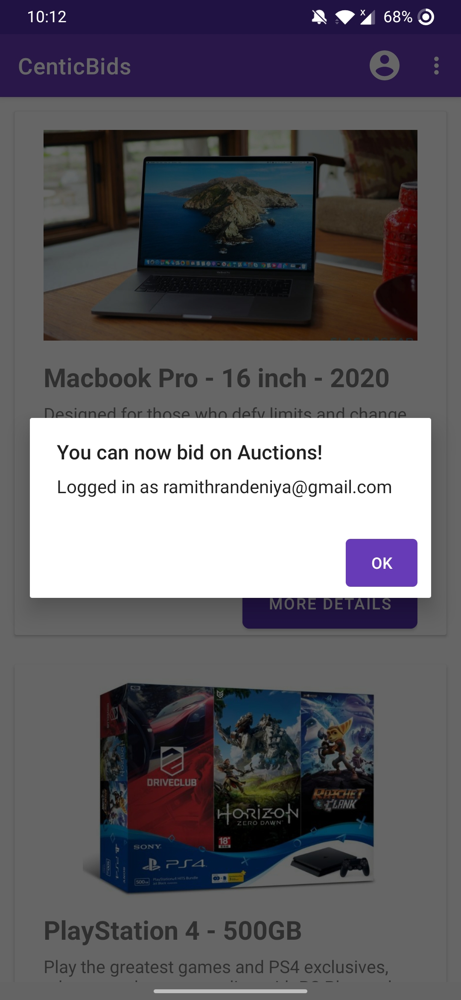

# CenticBids Mobile App

## App Features :

- Users can view all ongoing auctions (both authenticated and unauthenticated are able to)
- An auction item consists of the following attributes:
   1. Title
   2. Description
   3. Base price
   4. Lastest bid
   5. Auction item image
   6. Remianing time
   7. Bid now button    
- An authenticated user can place a bid on an item in the item details page
- Users who have already bid on a specific item will receive a notification (FCM push messsage) when they have been outbid
  
  
## App Architecture :

The application architecture follows the MVVM pattern (using ViewModels and LiveData) together with the repository pattern.

Since the app is using Firebase as the backend, the repository doesn't need to implement any caching mechanisms or communiate with a remote data source since Firebase SDK provides everything to effectively cache and manipulate data.

### Architecture diagram :

### Top-level Navigation Graph :

The application consists of 4 fragments :

1. AuctionsList fragment (start)
2. AuctionDetail fragment
3. Login fragment
4. Register fragment

## Firestore Schema :

The application uses two collections :

- __registered_users__ collection stores the following attributes :
   1. Email Address
   2. User authentication ID
   3. FCM Token (used for push messages)
   4. Two flags (authenticated & created)

- __auction_items__ collection stores the following attributes :
   1. Title
   2. Description
   3. Base price
   4. Auction item image url (images are stored in firebase storage)
   5. Remianing time
   6. Lastest bid amount
   7. User ID of the user who places the highest bid
   8. Bidding history (An array of maps storing records of each bid for a specific item)
      1.  Timestamp (millis)
      2.  Users Email address
      3.  User ID

## Cloud Function Trigger for Firestore :

A cloud function trigger was implemented using Nodejs which listens to an update even on the __auction_items__ collection. The itention of this function is to send push notifications to all the bidding participants for a specific auction item in the bidding history array (except the highest bidder) mentioning that they have been outbit by another user. 

GIT Repo URL => https://github.com/RamithRD/CenticBids_CloudFunction

The cloud function is deployed to Firebase successfully.

## App Screenshots :

